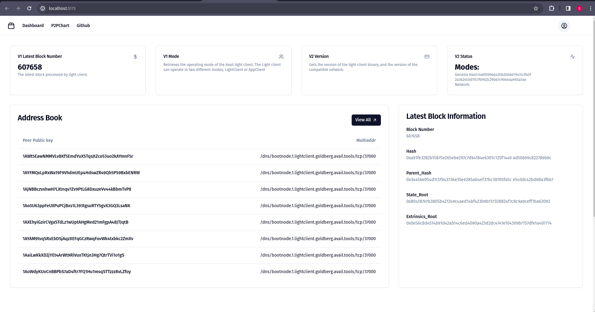
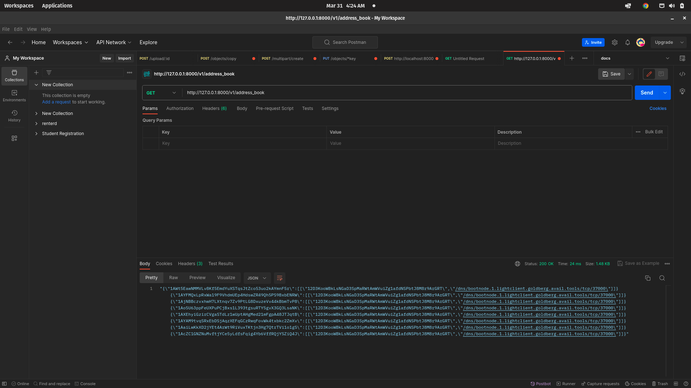

<h1>YouTube Video Link:-https://youtu.be/WDlJ5oJLr20</h1>

### P2P AddressBook: Avail DA Network Tracker

This project implements a P2P Address Book on Avail DA, a decentralized network technology. It tracks and logs all peers that connect to the avail network, creating a map of their PeerID and multiAddress. This address book enables peers to discover and connect to each other within the avail network. They can also connect with each other using out Address Book.

This helps in improving the overall efficiency of the avail network.

**Additional Features:**

- **Potential for Network Analysis:** By storing historical data, the logger can be used to analyze network activity and identify patterns in peer connections.
- **Privacy Considerations:** (Describe how the project handles user privacy. Does it anonymize addresses? Can users opt-out of being logged?)

**Project Setup:**

1. **Terminal 1: LC Node 1**

   ```bash
   cd light && ./target/release/avail-light
   ```

2. **Terminal 2: LC Node 2**

   ```bash
   cd light

   # This is one single command, make sure you copy everything
   cat << EOF >> myconfig2.yaml
   log_level = "info"
   http_server_host = "127.0.0.3"
   http_server_port = "7002"
   secret_key = { seed = "avail-2" }
   port = 37002
   full_node_ws = ["ws://127.0.0.1:9944"]
   app_id = 0
   confidence = 92.0
   avail_path = "avail_path2"
   bootstraps = ["/ip4/127.0.0.1/tcp/39000/quic-v1/12D3KooWStAKPADXqJ7cngPYXd2mSANpdgh1xQ34aouufHA2xShz"]
   EOF

   # Run LC
   ./target/release/avail-light --config myconfig2.yaml
   ```

   <h1>Architecture</h1>

   

   <br>

   We first start up firing up one Light-client on the Goldberg test network. Then we query the coming data in the Light-client from all the Peers to make our address book. The address book has all the PeerIDs, the multiAddresses.

   <h1>Getting peer Ids of _Avail_ Light Nodes</h1>

   

   <h1>UserInterFace For Our Application</h1>
   

 <h1>Postman Api EndPoint Result For Address Book </h1>
   
