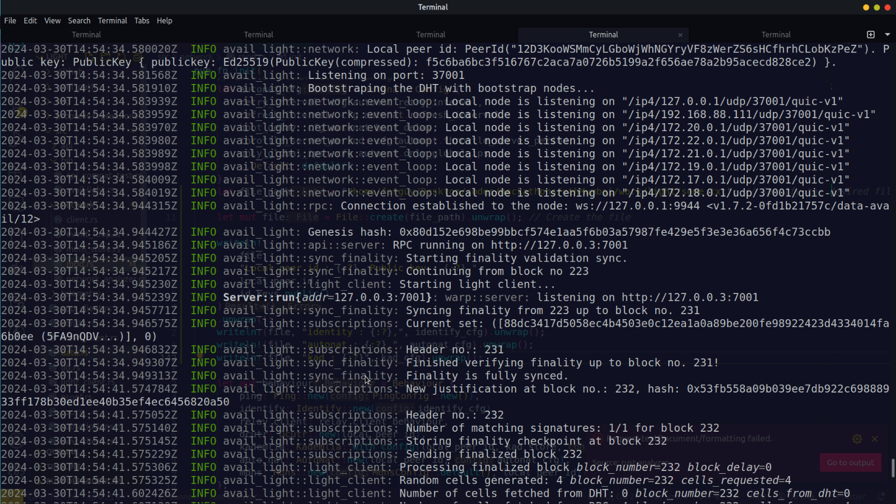

## P2P Address Logger: Avail DA Network Tracker

This project implements a P2P Address Logger on Avail DA, a decentralized network technology. It tracks and logs all peers that connect to the network, creating a map of the connected devices.

**Additional Features:**

* **Potential for Network Analysis:** By storing historical data, the logger can be used to analyze network activity and identify patterns in peer connections.
* **Privacy Considerations:** (Describe how the project handles user privacy. Does it anonymize addresses? Can users opt-out of being logged?)

**Project Setup:**

1. **Terminal 1: LC Node 1**

   ```
   cd light && ./target/release/avail-light
   ```

2. **Terminal 2: LC Node 2**

   ```
   cd light

   # This is one single command, make sure you copy everything
   cat << EOF >> myconfig2.yaml
   log_level = "info"
   http_server_host = "127.0.0.3"
   http_server_port = "7002"
   secret_key = { seed = "avail-2" }
   port = 37002
   full_node_ws = ["ws://127.0.0.1:9944"]
   app_id = 0
   confidence = 92.0
   avail_path = "avail_path2"
   bootstraps = ["/ip4/127.0.0.1/tcp/39000/quic-v1/12D3KooWStAKPADXqJ7cngPYXd2mSANpdgh1xQ34aouufHA2xShz"]
   EOF

   # Run LC
   ./target/release/avail-light --config myconfig2.yaml
   ```

    **SnapShots**
   
   **Getting peer Ids of *Avail* Light Nodes**


